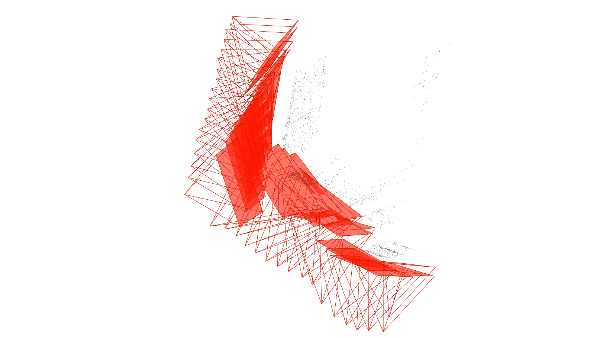
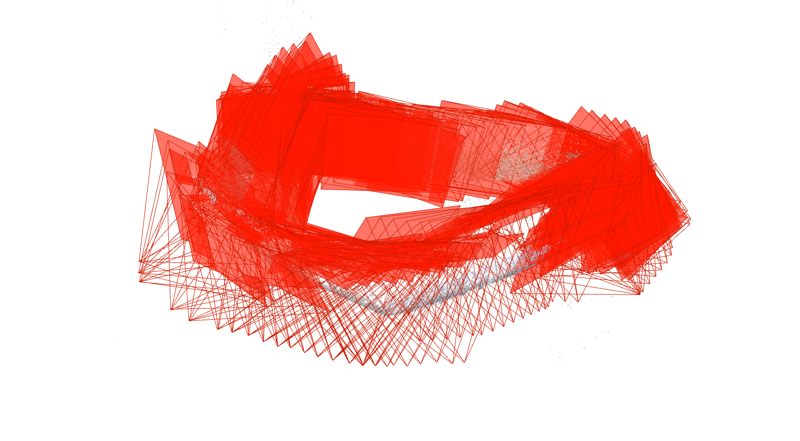
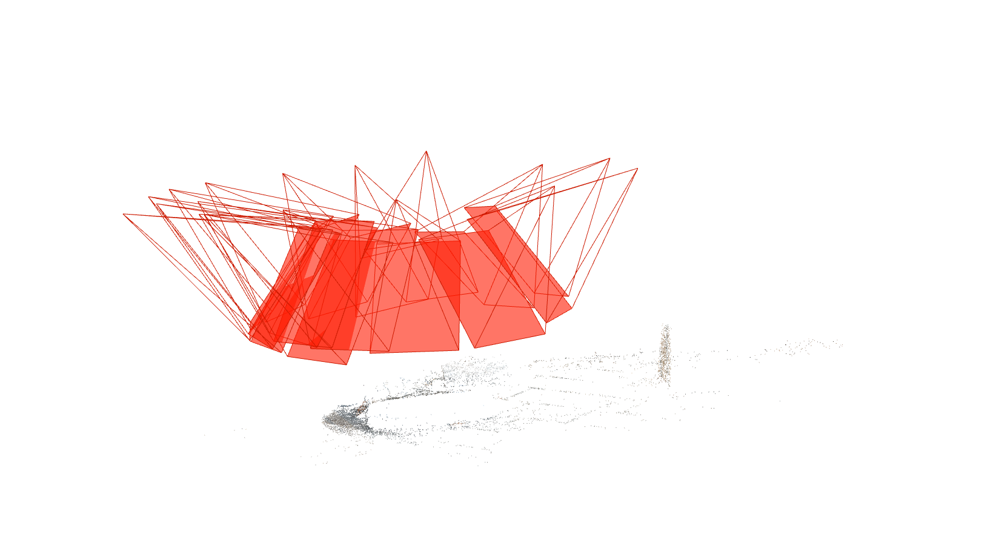

# COLMAP_using
COLMAP的使用——在校园内拍摄图像进行三维重建

COLMAP地址：https://github.com/colmap/colmap/releases/download/3.8/COLMAP-3.8-windows-no-cuda.zip

## 使用COLMAP在校园内拍摄图像进行三维重建

 一共拍摄了四组照片，其中前三组成功重建，第四组由于照片数量太少（只有17张），无法成功建模。
### 文档介绍
1. WHUbuilding
这是位于信息学部国家安全网络学院对面的一座大楼。image文件夹中共包含77张照片。最后只建模出四面墙之中的两面。
可能原因：
+ 在拍照时用一段被树枝遮挡住了，导致在做特征匹配时无法对应并续接，于是出现中断。

1. WHUbuilding2
image文件夹中包含万林博物馆的147张照片。最后应该算是建模出了部分底部，由于缺少空中拍摄机器无法获得更多顶层细节内容。
+ 博物馆附近没有合适的拍摄角度，距离建筑太近了。导致某些时候需要在一个位置多拍几张用来补充细节
+ 下图可能看不清楚，我还没琢磨明白怎么在COLMAPS取消红色相机部分的显示。

3&4. WHUthing1&2
由于担心建筑建模不成功，于是拍了几张小物体用来建模。两个物体都只拍摄了17张。由于拍摄数量较少，建模效果明显较差。

### 总结
+ COLMAP建模需要较多图片提供细节用来匹配和寻找特征点，才能有较好的效果。
+ 图片质量也十分重要，推荐阴天拍摄，避免过曝导致细节丢失。
+ 为了追求建筑的完整性，最好在拐角处多拍几张照片用作模型的匹配衔接，避免出现第一种建模建一半的情况。

于2023.3.6开源在github上

